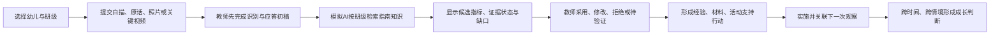

# 同迹 3.0《3-6岁儿童学习与发展指南》知识库说明

## 1. 建设目的

本知识库用于把儿童所在班级、真实游戏观察和《3-6岁儿童学习与发展指南》建立可追溯连接，帮助教师与 AI：

- 选择与小班、中班、大班相符的年龄段参照。
- 从原始行为证据中识别可能相关的发展目标。
- 判断本次证据支持到什么程度，以及还缺什么证据。
- 设计经验、材料、活动三类应答并安排后续复察。
- 避免用一次观察、一个视频或单一结果给幼儿贴标签。

知识库不是儿童考试题库、诊断量表或排名工具。

## 2. 正式来源与版本

- 正式来源：[教育部关于印发《3-6岁儿童学习与发展指南》的通知](https://www.moe.gov.cn/srcsite/A06/s3327/201210/t20121009_143254.html)
- 发文字号：教基二〔2012〕4号
- 系统核对日期：2026年8月21日
- 系统知识版本：`guide-cn-2012.v1.0.0`
- 数据版本：`3003`

截至核对日期，教育部当前公开并使用的正式《指南》仍为上述版本，没有发现替代它的新版本。《指南》中的年龄段表现是3-4岁、4-5岁、5-6岁三个年龄段末期的大致合理期望。

## 3. 知识覆盖

| 层级 | 数量 | 内容 |
|---|---:|---|
| 领域 | 5 | 健康、语言、社会、科学、艺术 |
| 子领域 | 11 | 身心状况、动作发展、生活习惯与生活能力等 |
| 学习与发展目标 | 32 | 完整录入《指南》目标 |
| 年龄参照卡 | 96 | 32个目标分别建立小、中、大班参照 |
| 理论约束卡 | 3 | 形成性评价、最近发展区、生成性课程 |

源数据文件：`src/data/guideKnowledgeBase.ts`

## 4. 双层知识结构

### 4.1 来源层

来源层保存：

- 领域与子领域。
- 目标编号和目标名称。
- 小班3-4岁、中班4-5岁、大班5-6岁年龄段末期表现。
- 正式来源、发文字号、链接和知识版本。

来源层不混入 AI 生成文案，保证政策原文与产品转译可区分。

### 4.2 专业转译层

专业转译层保存：

- 游戏中的可观察行为。
- 适用证据场景。
- 关键词与场景关联。
- 最低证据要求。
- 误判提醒。
- 经验支持、材料支持、活动支持。
- 下一次观察问题。

专业转译层是教师和 AI 的工作辅助，不冒充国家文件原文。

## 5. 班级与年龄映射

| 儿童所在班级 | 年龄参照 | 编码后缀 |
|---|---|---|
| 小班 | 3-4岁年龄段末期合理期望 | `3-4` |
| 中班 | 4-5岁年龄段末期合理期望 | `4-5` |
| 大班 | 5-6岁年龄段末期合理期望 | `5-6` |

示例编码：

```text
GUIDE-SCI-INQ-02-3-4  小班 · 科学 · 科学探究 · 目标2
GUIDE-SCI-INQ-02-4-5  中班 · 科学 · 科学探究 · 目标2
GUIDE-SCI-INQ-02-5-6  大班 · 科学 · 科学探究 · 目标2
```

系统先读取儿童档案中的班级，再检索相同班级的年龄参照卡，禁止把大班要求直接用于小班儿童。

## 6. 发展参照判断

系统不输出“合格、不合格、优秀、落后”或综合分数，只使用以下状态：

| 状态 | 含义 | 可否形成稳定结论 |
|---|---|---|
| 已观察到相关表现 | 本次有直接行为证据与该目标相关 | 否，只代表本情境 |
| 部分证据 | 出现相关线索，但没有覆盖足够表现或证据类型 | 否 |
| 待继续观察 | 场景可能相关，但缺少直接行为证据 | 否 |
| 本情境不适用 | 该目标不适合通过当前场景判断 | 否 |

“较稳定”或“跨情境迁移”只能由多次已审核观察综合形成，不能由单次 AI 分析自动生成。

## 7. 证据最低要求

一般目标至少要求：

1. 两个不同时间点的相关表现。
2. 两类证据交叉印证，如连续白描、幼儿原话、关键视频、作品或介入记录。
3. 区分幼儿独立表现、同伴支持下表现和教师支持下表现。
4. 保留场地、主题、伙伴、材料和教师介入等情境信息。

特殊限制：

- 身高、体重只能来自规范健康检查记录，不能由 AI 从照片或视频估算。
- 安全能力不能通过制造危险进行测试。
- 方言、少数民族语言和个体表达方式应被尊重。
- 动作距离和时间是年龄段末期参考，不用于一次竞赛排名。

## 8. 模拟 AI 检索顺序

```text
儿童班级
→ 筛选同年龄段96张参照卡中的32张
→ 合并场地、主题、教师白描、幼儿原话、教师识别
→ 依据场景规则和证据关键词召回候选目标
→ 最多返回3个候选指标
→ 标注本次证据状态和缺口
→ 生成经验、材料、活动三类应答
→ 生成下一次复察问题
→ 教师逐条审核
```

优先级始终是：

```text
原始证据 > 教师观察重点 > 关联游戏计划 > 已审核历史证据 > 指标知识
```

知识库只能解释证据，不能覆盖或补写原始事实。

## 9. 应答设计规则

### 9.1 经验支持

用于连接已有经验、帮助回顾尝试、比较结果、表达理由和形成新问题。

### 9.2 材料支持

用于增加可比较材料、记录工具、空间线索或可逐步撤回的支架，不提供唯一标准答案。

### 9.3 活动支持

用于调整伙伴、时间、场地、分享方式和活动路径，让幼儿在新情境中继续行动。

每项应答必须说明：

- 为什么支持。
- 依据哪条证据和哪个年龄参照。
- 教师准备怎样做。
- 下一次重点观察什么。
- 支持后如何判断是否有效。

## 10. 教师实际使用流程



## 11. 维护规则

- 国家来源内容不可由园所修改。
- 园本指标必须使用独立编码和版本，不覆盖国家指标。
- 国家文件更新时先建立新版本，完成专业审核和迁移测试后再发布。
- 已生成分析保留当时引用的知识版本，不静默替换历史依据。
- 每次知识版本升级必须运行完整性、年龄隔离和 AI 引用测试。

## 12. 当前演示边界

- 当前为本地规则引擎和模拟 AI，不调用真实模型。
- 场景和关键词只负责召回候选指标，最终判断由教师审核。
- 当前演示班级为大班，但知识库已完整支持小班、中班、大班导入数据。
- 生产化后仍应保留相同知识版本、证据链和教师审核机制。
