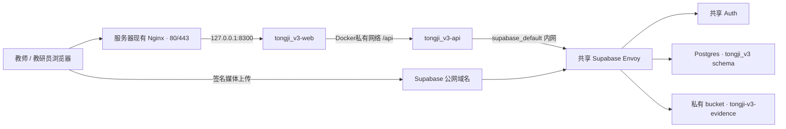

# 同迹 3.0 腾讯云轻量服务器部署

## 1. 部署拓扑



隔离规则：

- Compose 项目名固定为 `tongji_v3`，只管理本项目容器。
- API 无宿主机端口，仅加入童迹私网和共享 `supabase_default` 网络；不加入租房应用网络。
- Web 仅绑定 `127.0.0.1:8300`，不占用公网 80/443。
- Postgres 业务对象位于 `tongji_v3`；RLS辅助函数位于不暴露的 `tongji_v3_private`。
- 其他应用继续使用自己的 schema、Storage bucket、后端密钥和 Docker 网络。

## 2. 前置检查

- 服务器建议至少剩余1核CPU、1GB内存和5GB磁盘。
- Docker Engine与Compose插件可用。
- 现有反向代理、证书目录和应用端口已经备份。
- 共享 Supabase 已备份，且没有同名 `tongji_v3` schema。
- 准备独立域名，本机约定为 `tongji.meidaquan.com`。

Supabase 自定义 schema 需要显式加入 PostgREST 的 `PGRST_DB_SCHEMAS`。迁移文件已包含授权和 RLS；只添加 `tongji_v3`，不要暴露 `tongji_v3_private`。

## 3. 数据库迁移

迁移文件按顺序执行：

```text
apps/v3-api/supabase/migrations/20260821055850_tongji_v3_production_schema.sql
apps/v3-api/supabase/migrations/20260821090000_tongji_v3_governance.sql
apps/v3-api/supabase/migrations/20260821103000_tongji_v3_shared_auth_trigger_isolation.sql
apps/v3-api/supabase/migrations/20260821104500_tongji_v3_auth_domain_isolation.sql
apps/v3-api/supabase/migrations/20260821121751_fix_classroom_returning_rls.sql
apps/v3-api/supabase/migrations/20260821122655_fix_research_activity_returning_rls.sql
apps/v3-api/supabase/migrations/20260824064422_preserve_archived_classroom_history.sql
apps/v3-api/supabase/migrations/20260824072542_add_claim_reviews_and_semantic_evidence.sql
apps/v3-api/supabase/migrations/20260827055219_expand_observation_analysis_curriculum.sql
```

托管 Supabase：

```bash
cd apps/v3-api
npx supabase login
npx supabase link --project-ref <PROJECT_REF>
npx supabase db push
```

同机自托管 Supabase 使用已验证脚本执行：

```bash
cd deploy/tongji-v3
chmod +x ./*.sh
./migrate.sh
```

脚本逐个事务执行迁移，并检查基础表、治理表、共享 Auth 触发器兼容状态、创建回读 RLS 修复，以及多人观察、组合应答、课程循环和专业记忆结构。兼容迁移只在服务器存在租房应用的 `private.handle_new_auth_user()` 触发器时生效：租房用户保持原逻辑，带有 `application=tongji_v3` 标记或使用 `@tongji-v3.local` 内部邮箱域名的同迹用户不写入租房资料表。迁移后将 `tongji_v3` 追加到 `PGRST_DB_SCHEMAS`，再只重建 `supabase-rest`；不要移除其他应用正在使用的 schema。

## 4. 配置与初始化

```bash
cd deploy/tongji-v3
cp .env.example .env
chmod 600 .env
```

替换 `CORS_ORIGIN`、Supabase 公网地址、内网地址、两个密钥和首个教研员信息。自托管环境中 `SUPABASE_PUBLISHABLE_KEY` 使用现有 `ANON_KEY`，`SUPABASE_SERVICE_ROLE_KEY` 只能进入 API 容器，命令输出中不得打印密钥。

启用千问时将 `AI_MODE=qianwen`，并在服务器 `.env` 中设置标准按量付费 `DASHSCOPE_API_KEY`。后端禁止使用 `sk-sp-` Token Plan 密钥。`QWEN_MEDIA_ANALYSIS_ENABLED` 默认关闭；只有完成监护授权与数据处理告知后再开启。无需真实AI时保持 `AI_MODE=simulated`。

```bash
./deploy.sh
./seed.sh
./bootstrap-admin.sh
curl -fsS http://127.0.0.1:8300/healthz       # Web容器
curl -fsS http://127.0.0.1:8300/api/healthz   # API、schema与AI配置
```

`bootstrap-admin.sh` 在终端中隐藏读取密码，只把密码传给一次性容器，不写入 `.env`。

## 5. 接入现有 Nginx

域名解析生效后先使用 `nginx-site.http-bootstrap.conf` 提供 HTTP 代理和 ACME 验证目录；证书签发后替换为 `nginx-site.example.conf` 的 HTTPS 配置，将 `tongji.meidaquan.com` 代理到 `127.0.0.1:8300`。平滑重载前检查：

```bash
nginx -t
systemctl reload nginx
```

不要删除、覆盖或重启其他应用的 server block。

Certbot 使用 Webroot 签发时，将 `certbot-nginx-reload.sh` 安装到 `/etc/letsencrypt/renewal-hooks/deploy/`，并启用 `certbot-renew.timer`，确保证书续期成功后平滑重载 Nginx。

## 6. 上线验证

```bash
docker compose --env-file .env ps
docker compose --env-file .env logs --tail=100 api
curl -fsS https://tongji.meidaquan.com/healthz       # Web健康
curl -fsS https://tongji.meidaquan.com/api/healthz   # API健康
```

浏览器验证：

1. 首个教研员可登录。
2. 教研员可创建班级、教师账号并分配班级。
3. 教师只看到被分配班级。
4. 教师可新增幼儿和标准观察。
5. 媒体使用签名地址进入私有bucket。
6. AI输出事实、解释、假设、知识依据与应答，页面显示实际Provider与模型。
7. 千问媒体分析开启后，仅授权为 `granted` 的图片/视频画面会参与分析，视频音轨不处理。
8. 教师可逐条采用、修改、拒绝或标记待验证；终审后只为采用或修改的应答建议创建行动。
9. 停用账号后，旧页面下一次请求立即失败。
10. 教研员可完成观察质量审核与导出审批，教师无审批权限。
11. 教研活动进行中教师可提交独立记录，结束后停止提交。
12. 采用AI建议后可实施应答、填写复察证据并进入成长轨迹。
13. 报告至少需要2条、跨2个日期的终审证据；课程线索使用可解释语义聚类并回链多幼儿、多时间点观察。

## 7. 更新、回滚与备份

- 更新仅运行 `./deploy.sh`，不会操作其他Compose项目。
- 应用回滚切换到上一个代码版本后重建镜像。
- 数据库使用新增的向前修复迁移，不直接删除共享schema。
- Supabase启用每日备份并定期验证恢复。
- 腾讯云监控CPU、内存、磁盘、带宽与容器重启次数。
- Storage配置保留期限与容量告警，不使用幼儿数据训练通用模型。
