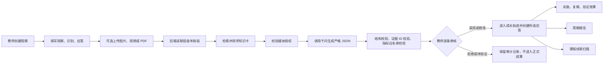

# 童迹 3.0 AI 输入输出接口、业务规则与需求符合度

> 文档性质：产品、教育专业与技术联合验收依据  
> 对应版本：童迹 3.0 逐条循证审核升级版
> AI Provider：千问 `qwen3.7-plus`，故障时可明确回退为本地模拟规则  
> 核心原则：AI 只生成教师审核用草稿，不作诊断、排名、综合评分或自动发布

## 1. 先说结论

童迹 3.0 当前有四类真实 AI 能力：

1. **游戏观察与纵向分析**：分析本次教师记录、年龄段知识卡、授权媒体画面，以及该幼儿此前经教师终审采用的观察。
2. **逐条结论审核**：教师可对摘要、事实、解释、假设、经验、兴趣、指标、应答、复察和历史变化逐条采用、修改、拒绝或标记待验证。
3. **周期报告生成**：个体报告至少汇总2条、跨2个日期且经教师终审采用的观察；班级报告另需覆盖至少2名幼儿，生成教师版、家长版或班级证据画像草稿。
4. **语义课程聚类与草案生成**：将用词不同但兴趣语义相近的观察聚合，再对达到门槛的持续证据生成课程草案。

本次升级已经补齐逐条审核、完整字段展示、历史比较、多时间点报告门槛和语义兴趣聚类。仍需继续改进的边界是：

- 视频只分析画面，不处理音轨，也没有真实语音转写和事件自动分段。
- 合法证据 ID 校验不能完全替代教师对画面语义真实性的核验。
- 报告目前保存整体观察证据索引，尚未给每一句报告文字单独绑定结论 ID。
- 报告正文尚未开放逐段编辑和版本差异审计。

因此，当前版本适合定位为：**具备逐主张审核和自动纵向比较的生产级循证观察版本**，但仍不把 AI 视觉识别或生成文本当作无需人工复核的科研事实。

## 2. AI 在业务中的位置



AI 不是教师输入的替代品。当前标准流程要求教师先完成：

`观察事实 → 教师识别 → 教师应答 → AI 第二视角与历史比较 → 教师逐条审核 → 教师终审`

## 3. AI 接口分层

系统包含两层 AI 接口，产品验收时需要区分。

### 3.1 浏览器到童迹后端

教师端不会直接把提示词发送给千问，而是先保存业务数据，再按观察 ID 发起分析。

| 操作 | 童迹接口 | 请求主体 | 作用 |
|---|---|---|---|
| 保存观察 | `POST /api/observations` | 完整观察表 | 保存教师原始输入 |
| 申请媒体上传 | `POST /api/observations/:id/evidence-ticket` | 文件名、MIME、大小 | 校验格式、大小和授权，创建证据记录 |
| 上传媒体 | `POST /api/evidence/:id/upload` | 二进制文件 | 保存到 Supabase 私有对象存储 |
| 发起 AI 分析 | `POST /api/observations/:id/analyze` | 无请求主体 | 后端按 ID 组装观察、知识与媒体 |
| 审核单条 AI 结论 | `PATCH /api/analyses/:id/claims/:claimKey` | 决定、修改稿、说明 | 采用、修改、拒绝或待验证 |
| 完成教师终审 | `POST /api/analyses/:id/finalize` | 终审说明 | 原子更新正式状态并创建所选应答 |
| 生成周期报告 | `POST /api/reports/generate` | 幼儿、班级、报告类型、周期 | 汇总已采用证据生成草稿 |
| 扫描课程线索 | `POST /api/curriculum-clues/scan` | 班级 ID | 语义聚类相近兴趣并检查时间点门槛 |

所有接口使用登录 Cookie 鉴权，并受班级权限、园所租户和 Supabase RLS 约束。

### 3.2 童迹后端到千问

后端调用：

`POST {QWEN_BASE_URL}/chat/completions`

关键参数：

```json
{
  "model": "qwen3.7-plus",
  "temperature": 0.2,
  "enable_thinking": false,
  "response_format": {
    "type": "json_schema",
    "json_schema": {
      "name": "业务场景对应名称",
      "strict": true,
      "schema": "童迹定义的严格 JSON Schema"
    }
  }
}
```

默认超时为 120 秒。网络错误、HTTP 429 和上游 5xx 最多重试 2 次。生产环境启用安全回退时，千问不可用或输出校验失败会生成明确标记的模拟草稿，不会冒充真实千问结果。

## 4. 游戏观察分析：教师需要提供什么

### 4.1 教师必填输入

| 输入项 | 格式或限制 | AI 如何使用 | 填写质量要求 |
|---|---|---|---|
| 班级 | 小班、中班或大班 | 决定知识库年龄段 | 必须选择真实所在班级 |
| 主要观察幼儿 | 单名幼儿 | 建立本次证据归属 | 当前一条观察只支持一个主要幼儿 |
| 记录标题 | 1-120 字 | 业务检索，不直接进入模型 | 能概括本次事件 |
| 发生时间 | 带时区的日期时间 | 建立时间轴 | 使用实际发生时间 |
| 游戏场地 | 1-80 字 | 知识卡检索与情境分析 | 如“建构区”“沙水区” |
| 游戏主题 | 1-120 字 | 知识卡检索及课程聚类 | 同一持续主题尽量保持命名一致 |
| 组织阶段 | 计划、导入、过程、分享、评价 | 解释行为发生阶段 | 选择主要发生阶段 |
| 客观白描 | 10-12000 字 | 事实层的首要证据 | 写动作、语言、材料、同伴和变化，不先下结论 |
| 教师识别 | 5-6000 字 | 与 AI 解释进行对照 | 写“可能体现”的经验、兴趣或困难 |
| 应答类型 | 经验、材料或活动支持 | 保存教师原始决策 | 选择主要支持类型 |
| 应答策略 | 2-2000 字 | 与 AI 建议对照 | 写下一步具体做什么 |
| 复察重点 | 2-1000 字 | 生成下一轮观察建议 | 写支持后准备观察什么变化 |

### 4.2 教师可选输入

| 输入项 | 限制 | 当前处理方式 |
|---|---|---|
| 持续时间 | 1-240 分钟 | 保存为观察背景，目前不发送给观察 AI |
| 观察重点 | 最多 12 项，每项最多 80 字 | 保存到观察记录，目前不发送给观察 AI |
| 幼儿原话 | 最多 3000 字 | 作为独立证据 `child-quote` 发送给 AI |
| 图片 | JPG、PNG、WebP，单项不超过 10MB | 授权后发送短时签名链接给视觉模型 |
| 视频关键片段 | MP4、MOV，单项不超过 100MB | 授权后按 `fps=1` 进行画面理解 |
| PDF | 单项不超过 10MB | 可以存档，但当前不把 PDF 内容发送给模型 |

教师端一次最多选择 5 个媒体文件。模型侧由 `QWEN_MAX_MEDIA` 再限制，代码默认分析前 2 项，配置允许的硬上限为 3 项。因此“成功上传”不等于“所有媒体都已被 AI 分析”。

### 4.3 高质量白描示例

不推荐：

> 小明很聪明，搭桥能力很好，也很有合作精神。

推荐：

> 10:12，小明把两块长方体积木平放在两端，再把一块长板架在上面。小车第一次通过时长板中部下弯，他停下后从材料筐取出一块圆柱体放在长板中央，说“这里要顶住”。第二次小车通过时桥面没有下弯。他转向同伴说“你也试一下”。

后者可以支持 AI 分离动作顺序、问题、策略、原话和同伴互动，也便于后续复察。

## 5. 系统会自动补充什么

教师点击“运行分析”后，后端自动补充以下上下文，前端无需重复填写：

| 自动上下文 | 来源 | 是否发送给千问 |
|---|---|---|
| 班级年龄段 | `classrooms.grade` | 是，只发送小/中/大班语境 |
| 幼儿姓名 | 幼儿档案 | 否 |
| 出生年月 | 幼儿档案 | 否，当前只用班级年龄段 |
| 监护授权状态 | 幼儿档案 | 仅用于后端媒体放行判断 |
| 年龄段知识卡 | 知识库 | 是，当前规则排序后最多 3 张 |
| 媒体证据 ID、类型、转写、事件分段 | 证据表 | 是；当前转写和事件分段通常为空 |
| 图片或视频短时链接 | 私有对象存储 | 仅在授权为 `granted` 且媒体分析开启时发送 |
| PDF 文件本体 | 私有对象存储 | 否 |

知识卡排序使用：

`场地 + 主题 + 教师白描 + 幼儿原话 + 教师识别 + 场景领域规则`

每张知识卡包含：指标编码、领域、子领域、标题、年龄段表现、游戏中的可观察行为、证据最低要求、评价提示、误判提醒、支持策略和下一轮观察提示。

## 6. 实际发送给观察模型的业务数据

下面是模型能看到的等价结构。媒体链接会作为独立的 `image_url` 或 `video_url` 内容项附加，不写入长期分析快照。

```json
{
  "ageContext": {
    "grade": "middle"
  },
  "observation": {
    "scene": "建构区",
    "theme": "积木桥承重",
    "organizationStage": "process",
    "teacherObservation": "教师客观白描……",
    "childQuote": "放中间不会弯",
    "teacherIdentification": "教师认为幼儿可能开始比较支撑位置……",
    "teacherResponse": {
      "category": "material",
      "strategy": "提供不同形状的支撑物供幼儿比较",
      "nextObservationFocus": "观察幼儿能否说明选择支撑位置的理由"
    }
  },
  "evidenceIds": {
    "teacherObservation": "teacher-observation",
    "childQuote": "child-quote"
  },
  "mediaAndTranscriptEvidence": [
    {
      "id": "证据UUID",
      "type": "video",
      "visualContentProvided": true
    }
  ],
  "allowedKnowledgeCards": [
    {
      "code": "GUIDE-SCI-INQ-02-4-5",
      "domain": "科学",
      "ageBand": "4-5岁",
      "title": "具有初步的探究能力",
      "officialExpectations": [],
      "observableBehaviors": [],
      "evidenceRequirements": [],
      "assessmentGuidance": [],
      "misunderstandingWarning": "……",
      "responseStrategies": {},
      "nextObservationPrompts": []
    }
  ]
}
```

模型还会收到明确限制：

- 事实只能来自教师白描、幼儿原话、已确认转写或媒体画面。
- 视频只分析画面，不能推断没有提供的音频内容。
- 指标编码只能从本次提供的知识卡中选择。
- 教师识别和应答必须原样保留，AI 只能补充。
- 不得输出诊断、排名、综合评分和确定性“达标/不达标”。
- 单次观察只能形成待验证假设。

## 7. 游戏观察分析：AI 输出了什么

输出使用 `camelCase` 字段，并经过严格 JSON Schema 与 Zod 双重校验。

| 输出字段 | 数量限制 | 含义 | 当前前端是否展示 |
|---|---:|---|---|
| `objectiveSummary` | 1 项 | 客观摘要 | **否**，仅保存 |
| `facts` | 1-12 项 | 事实、证据说明、证据 ID、置信度 | 部分展示，未展示证据 ID |
| `interpretations` | 0-12 项 | 可能解释、指标编码、证据 ID、限制、置信度 | 部分展示，未展示证据 ID、限制和置信度 |
| `hypotheses` | 1-8 项 | 待验证假设、下一轮观察、置信度 | 部分展示，未展示具体复察建议和置信度 |
| `teacherComparison` | 1 项 | 教师原识别、原应答、AI 补充 | **否**，仅保存 |
| `currentExperience` | 1 项 | 当前游戏经验概括 | **否**，仅保存 |
| `interestsAndStrengths` | 0-8 项 | 兴趣与优势线索 | **否**，仅保存，报告会使用 |
| `evidenceGaps` | 1-8 项 | 当前证据缺口 | **否**，仅保存，报告会使用 |
| `developmentReferences` | 0-10 项 | 年龄参照、证据状态、已有与缺失证据 | 展示 |
| `responseSuggestions` | 每类 1-5 项 | 经验、材料、活动三类应答 | 展示 |
| `nextObservation` | 1-6 项 | 下一轮观察重点 | **否**，仅保存，报告和支持行动会使用 |
| `evidenceSufficiency` | 枚举 | `有限` 或 `初步充分` | 展示 |
| `warnings` | 1-8 项 | 风险与使用边界 | 展示 |

完整结构模板：

```json
{
  "objectiveSummary": "本次观察的客观摘要",
  "facts": [
    {
      "content": "幼儿将支撑物移动到桥面中央后再次让小车通过",
      "evidence": "教师客观白描",
      "evidenceIds": ["teacher-observation"],
      "confidence": 0.94
    }
  ],
  "interpretations": [
    {
      "content": "该行为可能体现幼儿正在比较支撑位置与桥面稳定性的关系",
      "indicatorCode": "GUIDE-SCI-INQ-02-4-5",
      "evidenceIds": ["teacher-observation"],
      "limitation": "当前只有一次相同情境证据，尚不能判断经验是否稳定迁移",
      "confidence": 0.76
    }
  ],
  "hypotheses": [
    {
      "content": "幼儿可能已形成中央支撑更稳定的初步假设",
      "nextObservation": "更换桥面长度和支撑物形状，观察其选择与解释",
      "confidence": 0.65
    }
  ],
  "teacherComparison": {
    "teacherIdentification": "教师原始识别原文",
    "teacherResponse": {
      "category": "material",
      "strategy": "教师原始应答原文",
      "nextObservationFocus": "教师原始复察重点"
    },
    "aiAddition": "AI 在教师判断之外补充的证据与理论视角"
  },
  "currentExperience": "当前游戏经验概括",
  "interestsAndStrengths": ["兴趣或优势线索"],
  "evidenceGaps": ["还缺少的时间、场景或证据类型"],
  "developmentReferences": [
    {
      "indicatorCode": "GUIDE-SCI-INQ-02-4-5",
      "title": "具有初步的探究能力",
      "domain": "科学",
      "ageBand": "4-5岁",
      "status": "部分证据",
      "evidenceStatement": "本次观察中已经出现的相关证据",
      "missingEvidence": "继续判断所需要的证据"
    }
  ],
  "responseSuggestions": {
    "experience": ["经验支持建议"],
    "material": ["材料支持建议"],
    "activity": ["活动支持建议"]
  },
  "nextObservation": ["下一次观察重点"],
  "evidenceSufficiency": "有限",
  "warnings": ["本结果必须由教师审核"]
}
```

### 7.1 “是否达标”的实际表达

当前系统**不会输出二元的“达标/不达标”**，而使用：

- `线索`
- `部分证据`
- `较充分证据`

这是有意设计，不是遗漏。《指南》的年龄段表现应作为观察参照，不能把一次游戏行为直接变成考试结论。若业务方所说的“是否达标”是“是否已经出现与年龄参照相关的证据”，当前输出可以支持；若要求系统给出确定性的“达标/不达标”，当前系统不满足，而且从幼儿教育专业原则上也不建议这样实现。

## 8. 输出后的校验与业务动作

### 8.1 后端硬校验

千问返回后，系统还会执行：

1. 严格 JSON Schema 校验，不允许额外字段。
2. Zod 长度、数量、枚举和结构校验。
3. 每条事实必须引用本次允许的证据 ID。
4. 每条解释必须引用允许的证据 ID。
5. 指标编码必须来自本次后端提供的知识卡。
6. 指标标题、领域、年龄段由后端知识卡覆盖，不能由模型自由改写。
7. 教师原始识别和应答由后端覆盖回原文，不能被模型篡改。
8. 命中诊断、排名、综合评分及一组标签化词语时拒绝整次结果。
9. 自动增加“教师审核”和“单次观察限制”警告。

需要注意：当前证据校验可以确认“AI 引用了合法证据 ID”，但还不能完全自动证明“每个事实语义都真实存在于视频或白描中”。视觉模型仍可能发生带合法 ID 的内容误读，所以教师审核不能取消。

### 8.2 教师逐条审核与终审

单条审核接口请求：

```json
{
  "decision": "modified",
  "content": "教师修改后的正式表述",
  "note": "修改依据或保留意见"
}
```

支持：

- `adopted`：按AI原文采用。
- `modified`：保留AI原文，同时保存教师修改稿并以修改稿生效。
- `rejected`：拒绝，不进入成长、报告和应答。
- `to_verify`：保留为待验证假设，不进入正式成果。

全部结论处理后调用终审接口。终审后：

- 至少一项采用或修改时，观察状态变为 `adopted`；全部为拒绝或待验证时变为 `abandoned`。
- 只有教师采用或修改的应答建议会分别创建支持行动，不再固定取第一条经验建议。
- 支持行动进入“待实施 → 已实施 → 待复察 → 已验证 → 已关闭”状态机。

AI原稿、教师修改稿、逐条决定、审核说明、审核人和时间均独立保存，可在前端证据链中核对。

## 9. 周期报告 AI 接口

### 9.1 教师需要提供

```json
{
  "classroomId": "班级UUID",
  "childId": "幼儿UUID，班级报告省略",
  "reportType": "teacher | guardian | classroom",
  "periodStart": "2026-08-01",
  "periodEnd": "2026-08-31"
}
```

`reportType` 可取：

- `teacher`：教师专业版。
- `guardian`：家长交流版。
- `classroom`：班级证据画像，不传 `childId`。

### 9.2 系统自动输入给 AI

系统只读取周期内状态为 `adopted` 的观察，并关联：

- 观察 ID、发生日期、场景、主题、教师白描、幼儿原话。
- 教师已采用的结构化 AI 分析结果。
- 对应支持策略、幼儿后续反应和效果判断。

幼儿姓名不发送给模型，标题由后端在生成后设置。

班级报告还会由系统确定性计算：观察总数、日期数、已覆盖幼儿数/班级在园幼儿数、场景覆盖、五大领域已终审证据条数、支持策略复察率和已形成课程线索。AI不能修改这些数字，只能提炼共同兴趣、持续问题和下一步建议；发送给模型的幼儿标识会替换为 `child-1` 等临时编号。

### 9.3 标准输出

| 字段 | 作用 |
|---|---|
| `title` | 报告标题，后端统一设置 |
| `evidenceBoundary` | 证据边界与非比较说明 |
| `observationCoverage` | 本周期观察覆盖概括 |
| `interests` | 主要兴趣 |
| `evidencedGrowth` | 有证据支持的变化 |
| `teacherSupport` | 教师支持及后续效果 |
| `pendingQuestions` | 仍需验证的问题 |
| `nextPlan` | 下一周期计划 |
| `familySuggestions` | 家庭共玩建议 |
| `audience` | `teacher` 或 `guardian` |

班级报告使用独立结构：`observedChildCount`、`totalChildCount`、`observationCount`、`timePointCount`、`sceneCoverage`、`commonInterests`、`recurringQuestions`、`domainEvidence`、`supportFollowUpRate`、`curriculumClues`、`nextSuggestions` 和固定的 `audience=classroom`。

报告记录还保存：Provider、模型、提示词版本、是否发生回退，以及整体证据观察 ID 列表。

### 9.4 报告证据门槛与限制

- 必须至少存在2条、跨2个不同中国本地日期且经教师终审采用的观察。
- 班级报告还必须覆盖至少2名幼儿；单一个案即使观察次数足够，也不能生成班级画像。
- 报告只读取逐条采用或教师修改后的AI结论，拒绝及待验证项不会进入报告输入。
- 报告中的每条“成长变化”没有单独绑定观察 ID，只有报告整体证据索引。
- 教师目前只能把报告从草稿推进为已审核、已发布、已撤回，不能在页面上编辑 AI 文本。
- “完成教师审核”当前是状态按钮，不要求填写审核意见，也没有逐段确认。

## 10. 游戏课程 AI 接口

### 10.1 触发方式

教师选择班级后调用：

```json
{
  "classroomId": "班级UUID"
}
```

系统只扫描状态为 `adopted` 的观察，当前按照**完全相同的主题文字**分组。

AI 生成课程草案的门槛为：

```text
同一主题至少 2 条观察
并且（至少 2 名幼儿，或者同一组累计至少 3 条观察）
并且至少 2 个日期时间点
```

### 10.2 实际输入给 AI

```json
{
  "theme": "积木桥承重",
  "evidenceCoverage": {
    "observationCount": 3,
    "childCount": 2,
    "timePointCount": 2
  },
  "adoptedObservations": [
    {
      "occurredDate": "2026-08-20",
      "teacherIdentification": "教师识别",
      "teacherResponse": {
        "category": "material",
        "strategy": "教师应答",
        "nextObservationFocus": "下一观察重点"
      }
    }
  ]
}
```

课程扫描先由千问按主题、场景和教师识别进行语义兴趣聚类，并校验所有观察ID均来自本次输入且不重复；模型失败时回退为本地可解释语义规则。课程生成阶段仍主要接收教师识别和应答，因此课程证据细节还可继续增强。

### 10.3 标准输出

| 字段 | 作用 |
|---|---|
| `title` | 课程草案标题 |
| `origin` | 课程缘起和证据概括 |
| `inquiryQuestions` | 核心探究问题 |
| `existingExperience` | 幼儿已有经验 |
| `keyExperiences` | 可发展的关键经验 |
| `materialsAndEnvironment` | 材料与环境方案 |
| `possiblePaths` | 开放的可能路径 |
| `observationFocus` | 教师观察重点 |
| `familyAndCommunity` | 家庭与社区资源 |
| `adjustmentBasis` | 后续课程调整依据 |

课程记录保存整体观察 ID 回链和版本号。当前页面可编辑已有经验、探究问题、材料环境、可能路径和观察重点；其他生成字段虽然保存在数据中，但没有全部开放页面编辑。

## 11. 视频与多媒体分析边界

当前已经实现：

- 图片画面理解。
- MP4、MOV 视频画面理解。
- 私有存储、短时签名链接和授权校验。
- 模型结果引用媒体证据 UUID。
- 未授权时自动只做文字分析。

当前没有实现：

- 视频音轨识别。
- 幼儿原话自动转写。
- 说话人区分。
- 自动事件分段和时间码回链。
- 对长视频先剪辑再分析。
- PDF 内容解析。
- 自动判断视频中的人物身份。

因此老师上传视频后，AI 当前能够描述“画面中出现了什么行为和材料变化”，但不能可靠回答“幼儿具体说了什么”。需要分析语言内容时，教师必须在“幼儿原话”中手动填写，或等待后续接入 ASR 转写。

## 12. 保存、追溯与隐私

每次观察分析保存：

- `provider`
- `model`
- `prompt_version`
- `knowledge_version`
- 输入快照
- 实际关联的知识卡 ID
- 完整结构化结果
- 风险提示
- 教师决定、说明、审核人和时间

媒体链接使用 15 分钟签名地址，只存在于本次上游请求中，不写入分析快照或审计日志。媒体只有在监护授权为 `granted` 时才会发送给千问；`partial`、`pending` 和 `withdrawn` 均不会发送画面。

## 13. 异常与回退

| 情况 | 系统行为 |
|---|---|
| 观察不存在或无权限 | 返回 404 |
| 观察未提交 | 返回 409 |
| 班级或幼儿缺失 | 返回 422 |
| 年龄段知识库未初始化 | 返回 409 |
| 文件类型或大小不符合 | 返回 422 |
| 监护授权已撤回 | 拒绝新增媒体 |
| 千问超时、限流或 5xx | 自动重试；仍失败时按配置回退或返回 502 |
| 千问 JSON 不合法 | 结构校验失败并按配置回退 |
| 千问引用未知证据或指标 | 结果拒绝并按配置回退 |
| 命中标签化风险词 | 结果拒绝并按配置回退 |

回退结果会保存为：

- Provider：`ScenarioAIProvider`
- 模型：`simulated-ai-v3`
- `fallbackReason`：记录在服务日志和审计上下文中
- 页面提示：明确说明是模拟规则草稿

## 14. 原始需求符合度

| 原始需求 | 当前状态 | 判断 |
|---|---|---|
| 教师先记录观察、识别和应答 | 已完整实现 | 满足 |
| 按班级年龄段使用《指南》知识库 | 已按小、中、大班检索，并限制指标白名单 | 满足 |
| 上传图片和视频后进行 AI 行为分析 | 已支持授权图片和视频画面 | 基本满足，缺音轨与转写 |
| AI 输出标准化格式 | 三类场景均使用严格 JSON Schema | 满足 |
| 区分事实、解释和待验证假设 | 已实现并强制结构化 | 满足 |
| 所有判断回链原始证据 | 逐条显示证据ID、指标、置信度、AI原文和教师决定 | 基本满足，画面语义真实性仍需人工核验 |
| 教师逐条采用、修改、拒绝、待验证 | 主张级审核与终审事务已实现 | 满足 |
| AI 不覆盖教师原始判断 | 教师识别和应答独立保存并由后端原文覆盖 | 满足 |
| 应答可实施、复察和判断效果 | 已有完整状态机 | 满足 |
| 教师自由选择 AI 建议形成应答 | 只把逐条采用或修改的经验、材料、活动建议创建为行动 | 满足 |
| 精确对比幼儿跨时间成长 | 单次分析读取此前终审观察并输出结构化变化、稳定线索和证据ID | 基本满足，仍需教师核验解释 |
| 月度、学期、自定义周期报告 | 支持自定义日期、个体教师版、家长版和班级证据画像 | 满足 |
| 报告必须基于连续证据 | 强制至少2条、跨2个中国本地日期的终审观察 | 满足 |
| 教师修改报告后发布 | 有审核发布状态，但没有报告内容编辑 | **不满足** |
| 从持续兴趣生成课程 | 有多幼儿/多时间点门槛和课程草案 | 基本满足 |
| 相近兴趣自动聚类 | 千问按主题、场景和教师识别聚类，失败时使用本地可解释语义规则 | 满足 |
| 禁止排名、综合评分和诊断 | 提示词、Schema 后校验与状态机共同限制 | 满足 |
| 输出“是否达标” | 改为线索、部分证据、较充分证据 | 不做二元达标，符合形成性评价原则 |

## 15. 后续增强事项

1. 接入视频音轨 ASR、说话人标注和教师确认转写，并让事实回链到视频时间码。
2. 报告“成长变化”逐句绑定正式结论 ID，开放逐段编辑、审核意见和版本差异。
3. 课程 AI 输入继续增加脱敏白描摘要、幼儿问题、正式分析和知识卡依据。
4. 课程各部分逐项关联证据，并允许教研员人工合并或拆分语义聚类。

## 16. 产品验收时最应检查的五个问题

1. **事实是否真的出现在原始证据中？** 不能只看置信度和证据 ID。
2. **解释是否使用可能性语言并说明限制？** 单次行为不能写成稳定能力。
3. **指标是否确实来自对应年龄段知识卡？** 当前后端已做白名单校验。
4. **应答是否具体、可实施并有明确复察重点？** 没有复察的建议不能证明支持有效。
5. **最终进入成长、报告和应答的内容是否经过教师逐条审核？** 只允许采用或教师修改的结论进入正式成果，待验证项继续留在证据链中。

## 17. 一句话说明“我提供什么，系统给我什么”

教师提供：

> 一名幼儿在明确时间和游戏情境中的客观行为、原话、教师初步识别、准备采取的支持，以及可选的授权图片或视频证据。

系统输出：

> 一份以当前证据、历史终审观察和对应年龄段知识卡为边界的结构化 AI 草稿，包括事实、可能解释、待验证假设、跨时间变化、经验与兴趣、发展参照、支持建议和复察重点；教师逐条采用或修改并完成终审后，相关内容才进入应答追踪与周期报告。

---

## 18. 实现依据

- `apps/v3-api/src/routes/observations.ts`：观察、媒体和分析业务接口。
- `apps/v3-api/src/routes/outcomes.ts`：支持行动、报告和课程接口。
- `apps/v3-api/src/ai/contracts.ts`：业务输入与输出 Zod 契约。
- `apps/v3-api/src/ai/json-schemas.ts`：千问严格 JSON Schema。
- `apps/v3-api/src/ai/qianwen-provider.ts`：提示词、知识注入、媒体输入与后置守卫。
- `apps/v3-api/src/ai/qianwen-client.ts`：千问请求、重试和结构化响应解析。
- `apps/v3-api/src/ai/provider.ts`：真实 Provider 与模拟回退。
- `apps/v3-local/src/production/pages.tsx`：教师当前实际可见和可操作界面。
- `apps/v3-api/supabase/migrations/20260821055850_tongji_v3_production_schema.sql`：审核决策、支持行动与证据追溯数据结构。
