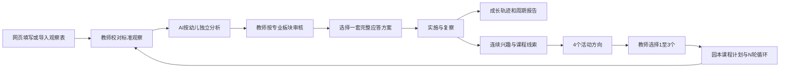

# 同迹 3.0 生产架构与实施状态

更新日期：2026-08-27
对应需求：`同迹建议8.27.docx` 与 D01-D10 默认决策

## 1. 产品定位

同迹 3.0 面向教师与教研员，将真实游戏中的零散信息转为可追溯的专业证据，形成：



AI只提供建议稿，教师是正式专业结论、应答和课程的最终决策者。系统不做医学或心理诊断，不做幼儿排名、综合评分或单次观察的确定性“达标”判定。

## 2. 技术架构

```text
浏览器 React/Vite
  -> HTTPS / Cookie Session
Fastify API
  -> Supabase Auth
  -> Supabase Postgres schema: tongji_v3
  -> Supabase Storage 私有证据桶
  -> 千问 OpenAI 兼容接口
  -> DOCX/PDF/DOC 解析与 Word 生成
```

- 前端：`apps/v3-local`
- 后端：`apps/v3-api`
- 数据迁移：`apps/v3-api/supabase/migrations`
- 当前扩展迁移：`20260827055219_expand_observation_analysis_curriculum.sql`
- 角色：教师、教研员
- 隔离：应用级 `tongji_v3` schema、`tenant_id`、RLS、班级访问范围
- 影像：私有存储，按授权状态和配置决定是否提供给视觉模型

## 3. 核心业务模块

### 3.1 观察记录

- 网页填写和上传 DOCX、DOC、PDF、JPG、PNG 双入口。
- 提供空白标准观察表 Word 下载。
- 文档先解析为字段草稿，教师校对后才保存为正式教师观察。
- 新记录不单独填写标题和幼儿原话；标题自动生成，原话写入客观白描。
- 一条观察可关联多名幼儿，必须指定一名主要观察幼儿。
- 每名幼儿可填写本次情境特征；未列名参与者只计人数，不进入个人轨迹。
- 图片、视频、作品等证据与观察记录关联并存入私有存储。

### 3.2 循证分析

每名幼儿独立生成一个分析版本，输出包括：

- 客观事实与证据引用；
- 七类游戏经验；
- 健康、语言、社会、科学、艺术五大领域经验；
- 六类学习品质；
- 学习与游戏可能；
- 历史观察变化与证据不足提示；
- 3套完整应答候选；
- 下一次观察切口与观察重点。

教师主界面按专业板块审核，可整组采用、拒绝或标记待验证；底层逐条 Claim、原内容、修改内容和证据链继续保留。教师反馈可触发 AI V2，新旧版本和反馈记录均不覆盖。

### 3.3 应答与复察

每次分析固定生成3套差异化候选，每套都必须包含活动支持、材料支持、经验支持、介入与退出条件、下一次观察切口和调整条件。

分析终审后教师选择1套，系统才生成3类实施任务。任务经历待实施、已实施、待复察、已验证等状态，并回链后续观察证据。

### 3.4 成长与报告

- 成长轨迹只读取教师已终审采用的分析。
- 个体报告支持教师版和家长版。
- 班级报告独立生成，统计儿童覆盖、场景覆盖、领域证据、支持跟进和课程线索。
- 个体正式报告要求多时间点证据，不以单条观察形成周期结论。
- 报告由教师审核后发布或撤回。

### 3.5 课程生成

- 教师可主动选择连续观察，也可运行语义兴趣聚类。
- 门槛：至少2个时间点，且涉及2名幼儿或同一幼儿至少3次观察。
- AI先生成4个可比较的活动方向。
- 教师选择1至3个，再按园所模板生成深度课程计划。
- 当前内置租户级模板为“同生课程·四区七步N循环”。
- 教研员可基于当前模板创建新版本并设为园所默认；历史课程保留模板版本回链。
- 课程可记录第N轮四区七步推进、经验生成、反思和新问题。

### 3.6 知识与园所经验

- 国家知识库按年龄段提供指标卡、可观察行为、证据最低要求、误判提醒和支持建议。
- AI请求只注入与年龄、场景、观察焦点相关的知识卡，不把整库发送给模型。
- 教师修订、有效应答和课程复盘可形成待审核园所经验。
- 只有教研员批准的经验可进入后续检索，且可停用。
- 园所经验不跨园，不使用幼儿原始影像训练通用模型。

### 3.7 Word与审批

- 空白观察模板可直接下载。
- 教师可直接生成并下载其权限范围内的观察记录、周期报告和课程计划；系统保留内容快照与操作审计，不再设置导出审批。
- 教研员批准后才生成私有 Word 文件和短期签名下载地址。
- 审批、生成、下载和失败状态均保留审计记录。

## 4. 关键数据对象

```text
observations -> observation_subjects -> evidence
observations -> analysis_runs -> analysis_claim_reviews
analysis_runs -> analysis_feedback_versions
analysis_runs -> response_plans -> support_actions -> follow-up evidence
curriculum_clues -> curriculum_activity_options
curriculum_clues -> curriculum_plans -> curriculum_cycles
professional_memories
export_requests -> document_exports
```

## 5. AI与知识边界

- 结构化 JSON Schema + Zod 双重校验。
- 事实必须引用允许的证据，指标必须来自本次检索白名单。
- 无证据领域必须输出“不作判断”。
- 多幼儿观察按幼儿分别分析；无法区分行为归属时明确提示不足。
- 千问不可自行决定权限、报告门槛、课程门槛或发布状态。
- 真实 Provider 失败时仅在配置允许时回退模拟，并显式保存回退标识。

## 6. 本轮实施状态

| 能力 | 状态 |
|---|---|
| 双入口观察、模板下载、文档解析校对 | 已完成代码实现 |
| 多幼儿观察与逐幼儿分析 | 已完成代码实现 |
| 板块审核、逐条证据链、AI V2 | 已完成代码实现 |
| 3套完整应答方案与选择后建任务 | 已完成代码实现 |
| 个体/班级周期报告 | 已完成代码实现 |
| 语义课程线索、4案选择、深度计划、N循环 | 已完成代码实现 |
| 课程模板版本管理 | 已完成代码实现 |
| 园所经验审核、启用和停用 | 已完成代码实现 |
| 观察与课程 Word 审批生成 | 已完成代码实现 |
| TypeScript、单元测试、生产构建 | 已通过 |
| 本地正式模式浏览器检查 | 已通过登录页、错误层与控制台检查 |
| 生产数据库迁移与发布 | 本轮未执行，需单独发布操作 |

## 7. 发布前必做

1. 对生产数据库执行新增迁移，并核对表、函数、索引、RLS和 grants。
2. 备份生产数据库后再执行迁移；备份用于故障恢复，不改变目标代码版本。
3. 构建 API 和生产前端，执行契约检查和登录后关键流程冒烟测试。
4. 使用虚构且已授权素材验证 DOCX导入、多人分析、应答选择、课程生成和Word审批下载。
5. 核对生产环境的千问密钥、模型名、媒体开关、Storage桶和Cookie安全配置。

由于本机没有 Docker/Podman，本轮不能用本地 Supabase 容器执行完整 `db reset`；迁移仍须在测试或生产前置数据库中实际执行验证。
