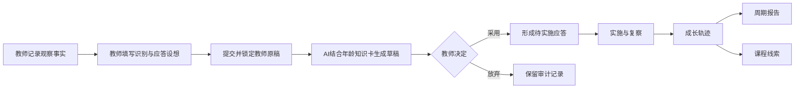
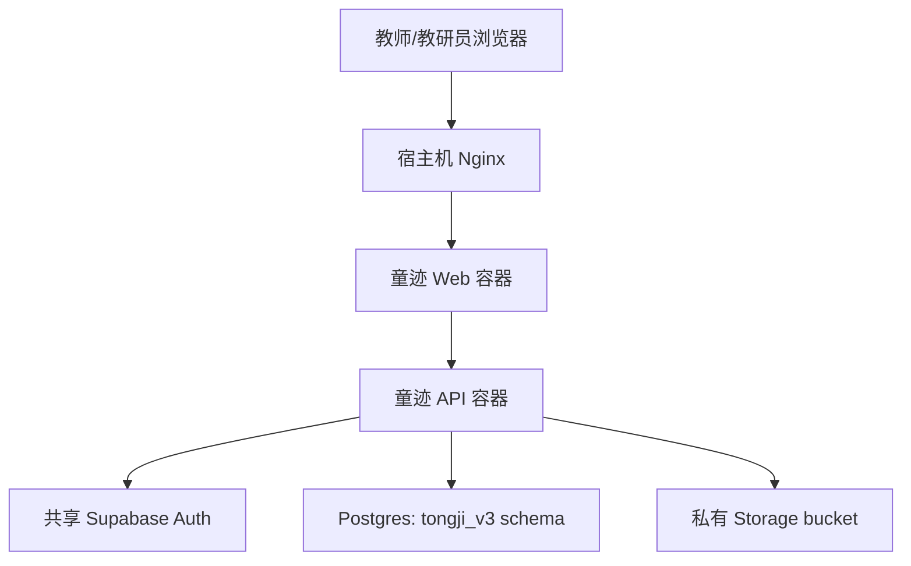

# 童迹 3.0 生产架构与实施状态

更新日期：2026-08-21

## 1. 产品闭环

童迹 3.0 面向教师和教研员，将“观察、识别、应答”标准化为同一份证据记录，并在教师保留专业判断权的前提下引入 AI 第二视角。

## 2. 角色与权限

### 教师

- 查看被分配的班级和幼儿。
- 创建标准观察、上传媒体证据、填写自主识别和应答。
- 对 AI 草稿作采用或放弃决定。
- 实施应答、补充后续反应并完成复察。
- 查看权限范围内的成长轨迹、报告、课程线索和教研活动。
- 发起导出申请。

### 教研员

- 查看全园业务数据。
- 创建、停用和恢复账号，分配教师班级权限。
- 管理班级和幼儿。
- 审核观察记录质量和导出申请。
- 发起教研活动并查看教师独立判断的差异对照。
- 审核课程线索与专业资料。

## 3. 业务模块

| 模块 | 作用 | 正式证据规则 |
|---|---|---|
| 班级与幼儿 | 建立观察对象和权限边界 | 教师仅访问被分配班级 |
| 标准观察 | 保存事实、原话、情境、教师识别与应答 | 原稿提交后锁定 |
| AI 辅助分析 | 输出事实、解释、假设、指标依据和应答建议 | 当前为模拟 AI；教师采用后才生效 |
| 应答与复察 | 记录支持策略、实施过程、幼儿反应和效果 | 验证效果必须补充后续证据 |
| 成长轨迹 | 纵向汇总已采用证据与支持效果 | 不生成综合分数或排名 |
| 周期报告 | 生成教师版或家长版阶段材料 | 只汇总指定周期的已采用证据 |
| 课程线索 | 从持续兴趣与未解决问题生成课程草案 | 至少两名幼儿或同一幼儿三次观察，跨两个时间点 |
| 指标中心 | 提供年龄参照、可观察行为和支持建议 | 指标用于解释和支持，不作单次达标判定 |
| 观察质量审核 | 审查事实性、具体性、时序性和证据匹配 | 不改写教师原稿，不评价幼儿能力 |
| 导出审批 | 管理用途、接收方和匿名化条件 | 审批不扩大原申请使用范围 |
| 教研活动 | 围绕共同证据开展独立判断与差异对照 | 活动结束后停止修改独立记录 |

## 4. 数据和基础设施

- API 不暴露宿主机端口，只加入童迹私网和 Supabase 共享网络。
- Web 只绑定宿主机回环地址，由现有 Nginx 反向代理。
- 业务表、函数与 RLS 位于 `tongji_v3`；私有辅助函数位于 `tongji_v3_private`。
- Auth 使用独立内部邮箱域名和应用元数据标记，避免污染共享 Supabase 中其他应用。
- 所有写操作记录审计事件；账号停用同时作用于业务资料和 Supabase Auth。

## 5. 当前实施状态

已实现并进入生产代码：

- 账号密码登录、教师/教研员权限和账号停用。
- 班级、幼儿和教师班级分配。
- 标准观察、私有媒体上传凭证、教师识别与应答。
- 基于知识卡的模拟 AI 分析及采用/放弃事务。
- 应答实施、复察、成长轨迹、周期报告和课程线索。
- 指南知识库、观察模板和理论卡。
- 观察质量审核、导出审批和教研活动。
- Docker/Nginx 部署、数据库迁移、知识种子和首个管理员初始化脚本。

当前明确边界：

- AI 尚未连接真实模型，也不读取视频画面或音轨。
- 线上系统仍需在真实使用前完成监护人授权流程、隐私政策、数据保留期限和运维告警的组织级配置。
- 指南年龄表现是观察参照，不应转化为幼儿排名、综合评分或诊断。

## 6. 后续生产化重点

1. 接入受控的多模态 AI 提供方，并保持现有固定输出和证据锚点契约。
2. 增加异步媒体分析任务、失败重试和人工转写确认。
3. 完成真实监护人授权、撤回授权、数据删除和媒体保留期任务。
4. 建立数据库备份恢复演练、容器监控、审计告警和依赖升级流程。
5. 通过教育专家标注案例持续校准知识检索与应答质量。
