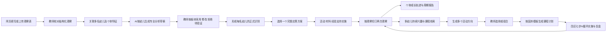
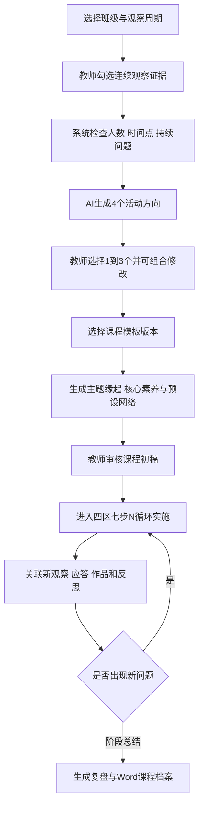

# 同迹建议 8.27：需求核对与产品优化方案

> 文档状态：D01-D10 已全部按建议默认确认，代码改造完成，待数据库迁移与发布
> 需求来源：`同迹建议8.27.docx`
> 课程模板来源：`2025-2026年游戏主题活动计划（3月试行）-模板.doc`
> 对照文档：`tongji-suggestions-2026-08-25-solution.md`
> 当前实现核对基线：同迹 3.0 生产代码 `72a6f16`，并结合 8.27 文档内的线上页面截图
> 实施基线：同迹 3.0 生产代码与 `20260827055219_expand_observation_analysis_curriculum.sql`

## 一、评审结论

8.27 版没有改变同迹 3.0 的基本方向，而是进一步明确了五个关键产品决策：

1. 观察记录长期保留“网页填写”和“上传观察记录表”两种入口，上传后先解析为教师可校对的结构化草稿。
2. 一次观察可以包含多名幼儿，每名幼儿可填写本次情境下的个体特征，AI 分析结果必须再分别归档到每名幼儿。
3. AI 分析界面不再把二三十条技术性 Claim 平铺给教师，而是按教师熟悉的专业板块审核；底层逐条证据链仍保留。
4. 每一个“应答方案”都必须同时包含活动支持、材料支持、经验支持，而不是只从三类中选择一类。
5. 课程生成采用两阶段方式：先基于教师选中的连续观察生成多个活动方向，再按附件课程模板生成可持续推进的课程计划。

当前系统已经具备观察录入、媒体证据、千问分析、逐条审核、历史观察、周期报告、语义课程线索等基础能力，但上述五项仍需做数据模型和业务流程升级，不能只通过改文案完成。

## 二、8.25 与 8.27 的变化

| 议题 | 8.25 状态 | 8.27 新增明确内容 | 本次结论 |
|---|---|---|---|
| 观察入口 | 提出网页填写与上传记录表并存 | 明确上传“结构化 Word 文档”，并提供标准模板下载 | 双入口并存，上传后回填统一观察草稿 |
| 幼儿原话 | 建议删除独立输入框 | 再次确认隐藏；原话写入客观白描 | 新记录不再单设幼儿原话 |
| 多幼儿观察 | 尚需确认个体还是群体特征 | 明确选择资料中的每名幼儿，并可分别填写幼儿特征 | 建立正式多幼儿关联模型 |
| AI 分析 | 建议事实、游戏经验、五大领域、学习品质和可能性 | 给出事实、领域分析和后续提升的表达示例 | 采用按幼儿、按专业板块输出的结构 |
| 应答 | 三类支持需具体化 | 明确每个方案必须同时含活动、材料、经验三类支持 | “方案”为父对象，三类支持为必备子项 |
| 审核 | 建议分组审核并保留证据链 | 明确按教师表格框架拆分、修改和采用 | 主界面板块审核，专业详情保留 Claim 审计 |
| 课程 | 等待课程模板 | 已提供“同生课程、1+N创N生、四区七步N循环”模板 | 可建立版本化课程模板和动态循环模型 |
| AI 经验积累 | 提出可控记忆 | 仍只有方向，没有明确共享范围与入库规则 | 方案可设计，权限边界仍需确认 |

## 三、目标业务闭环



产品上应明确区分三个阶段：

- **记录提取**：AI 只把上传资料转成结构化字段，不作发展评价。
- **专业分析**：AI 结合原始证据、幼儿年龄段知识和已审核历史提出建议稿。
- **教师决策**：只有教师采用或修改后的内容，才能进入成长轨迹、报告、应答和课程。

## 四、逐项需求理解、现状核对与优化方案

### R01 返回页面时图标加载慢

#### 需求理解

这不是单纯的网络问题。教师从业务页返回主页时，功能入口应立即出现，不能先显示空白卡片再逐个加载大图。

#### 当前核对

- 当前主页 11 张 PNG 图标单张约 0.8-1.2MB，合计超过 10MB。
- 当前资源体积和解码成本明显高于主页实际展示尺寸。
- 评审时状态（改造前）：**未解决**。

#### 产品与技术方案

- 图标统一转为 WebP/AVIF，按实际尺寸输出 1x/2x 两档。
- 单个图标建议不超过 120KB，首屏图片总量控制在 2MB 内。
- 主页首屏图标预加载，返回主页时复用缓存。
- 图片加载前显示同尺寸中文图形占位，避免布局跳动。
- 背景图单独优化，不与功能图标打包重复下载。

#### 验收标准

- 普通 4G 环境首次主页 LCP 小于 2.5 秒。
- 从业务页面返回主页，500ms 内可操作。
- 弱网下不出现空白卡片和明显布局跳动。

### R02 教研员页面仍有英文和内部键

#### 需求理解

教师和教研员不应看到英文页眉、数据库字段、Prompt 路径键或 JSON 结构；这些内容会让系统显得像开发工具而不是教育产品。

#### 当前核对

- 当前生产页面仍存在 `COLLABORATIVE INQUIRY`、`PERIOD REPORT`、`EMERGENT CURRICULUM` 等英文页眉。
- 历史课程数据可能把 `path_*` 等内部键直接展示为正文。
- 评审时状态（改造前）：**未解决**。

#### 产品与技术方案

- 用户可见导航、页眉、状态、错误信息全部中文化。
- 建立统一的显示字典；数据库字段可以保持英文，但组件不得直接显示内部键。
- API 返回前增加课程与 AI 结构归一化，旧数据同步兼容。
- 模型名、Prompt 版本、指标编码放入“专业依据/技术详情”折叠区。

#### 验收标准

- 教师和教研员主流程页面不出现未解释英文、内部键或对象字符串。
- 新旧数据采用同一中文展示规则。

### R03 网页填写与上传观察记录表双入口

#### 需求理解

教师既可以直接填写网页表单，也可以上传已完成的观察记录表。上传表格后，系统先识别字段并让教师校对，不应直接把文档当成正式分析结论。

#### 当前核对

- 生产版支持网页填写。
- 生产版支持 PDF、图片和视频作为补充证据，但不解析观察表正文。
- 生产版不支持 DOCX 观察表提取和标准模板下载。
- 本地演示代码虽允许 `.doc/.docx` 文件，但未形成生产级解析、校对和归档闭环。
- 评审时状态（改造前）：**部分具备，核心提取流程未实现**。

#### 产品方案

观察创建首页提供两张入口卡：

1. **填写标准观察**：进入网页表单。
2. **导入观察记录表**：下载标准模板或上传已有文档。

导入流程：

```text
选择文档
→ 文件安全与格式校验
→ 文档结构解析/OCR
→ AI提取标准字段
→ 标记低置信度字段
→ 匹配班级与幼儿档案
→ 教师逐项校对
→ 保存为教师观察草稿
→ 教师主动运行专业分析
```

标准提取字段：

- 观察教师、班级、时间、场地、主题、组织阶段；
- 幼儿姓名、人数、每名幼儿的情境特征；
- 客观白描，原话保留在白描上下文中；
- 教师原始识别；
- 教师原始应答；
- 下一次观察重点；
- 原文件、提取版本、教师确认版本及差异。

#### 技术方案

- 新增 `observation_imports`，保存原文件、解析状态、提取结果、字段置信度和确认版本。
- 新增 `extractObservationDocument` AI 接口，只允许字段提取，不允许输出儿童发展结论。
- 标准 DOCX 优先用结构化解析器读取，不依赖视觉 OCR。
- 非标准 DOCX/PDF/图片使用版面解析和 AI 提取，但所有低置信度字段必须由教师确认。
- 姓名匹配只在当前班级内进行；重名或未匹配时禁止自动关联。

#### 验收标准

- 标准模板上传后可正确回填主要字段。
- 低置信度字段有明显提示，未确认前不能提交。
- 文档解析结果与专业分析结果在界面和数据上严格分开。
- 上传文档不会跳过教师原稿确认。

### R04 简化网页观察字段

#### 需求理解

- “记录标题”和“游戏主题”重复，应删除教师填写的记录标题。
- “记录标题”所在位置改为“观察教师”。
- 独立“幼儿原话”输入框删除，原话直接写入客观白描。

#### 当前核对

- 当前记录标题和游戏主题均为必填。
- 当前观察教师只通过 `created_by` 隐式记录，表单没有明确展示。
- 当前仍有独立“幼儿原话（可选）”。
- 评审时状态（改造前）：**未解决**。

#### 产品方案

- 表单显示“观察教师”，默认当前登录账号，不要求重复输入姓名。
- 系统自动生成记录标题：`日期·场地·主题·主要幼儿等N名幼儿`。
- 删除新记录的独立幼儿原话字段；在客观白描输入区提示教师使用引号保留关键原话。
- 历史 `child_quote` 数据继续显示，但不再创建新值。

#### 验收标准

- 新建观察时不再要求填写记录标题和幼儿原话。
- 记录列表仍有清晰、可检索的系统标题。
- 正式观察中能明确看到观察教师。

### R05 一次观察关联多名幼儿及个体特征

#### 需求理解

同一份群体游戏资料可能包含多名幼儿。教师要选择资料中出现的幼儿，可选填写每名幼儿在本次情境中的特征；AI 既要理解群体互动，又要把与某名幼儿相关的分析分别归入其个人轨迹和报告。

“幼儿特征”是本次观察的情境补充，不是固定性格标签。例如可写“本次主动提出搭桥”“第一次加入该小组”，不宜写“胆小”“能力差”。

#### 当前核对

- 当前一条观察只有一个必填 `child_id`。
- 媒体证据、分析、应答和成长轨迹也都依赖单一幼儿。
- 评审时状态（改造前）：**未解决，涉及核心数据模型**。

#### 产品方案

观察对象区包含：

- 主要观察幼儿，可选 1 名；
- 参与幼儿，可选择多名；
- 其他未点名参与人数；
- 每名幼儿的本次特征、在游戏中的角色和证据片段；
- 群体情境说明。

AI 结果分为两层：

- **群体层**：共同问题、合作方式、角色关系和材料变化。
- **个体层**：每名幼儿实际出现的行为、可能经验、领域关联、学习品质和应答建议。

没有直接证据的幼儿不得因“出现在同一视频”而自动获得同样结论。

#### 数据方案

新增 `observation_subjects`：

```ts
interface ObservationSubject {
  observationId: string;
  childId: string;
  role: "primary" | "participant" | "incidental";
  contextualFeature?: string;
  evidenceAnchors: string[];
}
```

兼容策略：

- 旧 `observations.child_id` 先保留并作为 `primary_child_id` 使用。
- 新记录同步写入 `observation_subjects`。
- 成长轨迹、报告和分析查询逐步迁移到关系表，验证后再决定是否移除旧字段。

#### 验收标准

- 一次观察可关联多名幼儿，并逐人填写情境特征。
- 同一观察可以进入多名幼儿的证据索引，但每名幼儿只看到与自己相关的正式分析。
- 未点名人数不会进入个人成长轨迹。
- 系统不把情境特征固化为儿童人格标签。

### R06 网页观察与专业分析支持 Word 输出

#### 需求理解

网页填写或导入确认后的观察，应能输出标准 Word 文档，用于园内教研、归档和交流；附件中的观察表和课程表都说明 Word 仍是园所重要工作载体。

#### 当前核对

- 当前周期报告支持浏览器打印。
- 当前存在导出审批模块，但没有真正生成观察记录 DOCX。
- 评审时状态（改造前）：**未解决**。

#### 产品方案

提供三类 Word：

1. **空白观察模板**：任何登录用户可直接下载。
2. **教师观察记录**：包含教师确认的观察、识别、原始应答和证据目录。
3. **专业分析记录**：增加教师已采用或修改的 AI 分析、完整应答方案和下一次观察切口。

输出规则：

- 未审核 AI 内容不得进入专业版。
- 文档页眉注明园所、班级、生成时间、版本和用途。
- 对外文档不暴露数据库 ID、模型键名和 Prompt 信息。
- 原始影像不嵌入 Word，只展示经授权的缩略图或证据索引。

#### 技术方案

- 服务端按版本化 DOCX 模板生成，不在浏览器拼装。
- 新增 `document_exports` 保存模板版本、内容版本、审批状态、文件位置和审计记录。
- 生成内容使用稳定 JSON 中间结构，避免页面展示字段与 Word 模板耦合。

#### 验收标准

- 同一观察可生成教师原稿版和专业版。
- Word 内容与页面教师终审结果一致。
- 导出文件不存在内部英文键或未经审核的 AI 草稿。

### R07 AI 分析改为教师可理解的专业结构

#### 需求理解

需求方希望保留事实层，但把“解释层、待验证假设”转换为教师更容易用于专业判断的内容：

- 识别当前游戏经验；
- 挖掘健康、语言、社会、科学、艺术五大领域经验；
- 识别学习品质；
- 提出学习可能和游戏可能；
- 说明后续如何支持和继续观察。

这里不能把一次行为直接写成稳定能力或简单“达标/不达标”。国家年龄段表现是参照，不是一次观察的检查表。

#### 当前核对

- 当前已经输出事实、解释、假设、当前经验、发展参照和历史对比。
- 五大领域只作为零散参照卡出现，没有形成按领域组织的专业分析。
- 学习品质没有独立结构。
- 单次分析仍以技术化三层和 Claim 列表为主。
- 评审时状态（改造前）：**部分具备，需要重构输出合约和审核界面**。

#### 建议 AI 输出

```ts
interface ObservationAnalysisDraft {
  objectiveSummary: string;
  groupContext?: GroupContextAnalysis;
  children: Array<{
    childId: string;
    facts: EvidenceClaim[];
    gameExperience: {
      currentExperience: string[];
      evidenceBoundary: string;
    };
    domains: Array<{
      domain: "健康" | "语言" | "社会" | "科学" | "艺术";
      evidence: EvidenceReference[];
      possibleExperience: string;
      guideReferences: string[];
      missingEvidence: string;
    }>;
    learningDispositions: LearningDispositionClaim[];
    learningPossibilities: string[];
    gamePossibilities: string[];
    responsePlans: ResponsePlan[];
    observationCut: string[];
    observationFocus: string[];
    warnings: string[];
  }>;
}
```

界面顺序：

1. 客观事实与证据；
2. 游戏经验；
3. 五大领域经验；
4. 学习品质线索；
5. 学习可能与游戏可能；
6. 完整应答方案；
7. 观察切口与观察重点；
8. 证据充分性和风险提示。

输出约束：

- 五大领域不强制全部给结论；没有证据时写“本次不作判断”。
- 每项专业解释必须指向事实或媒体证据锚点。
- 单次观察只使用“本次出现、可能体现、仍需观察”等语言。
- “初现、发展中、较稳定、跨情境迁移”只允许在多时间点、跨情境证据满足门槛后使用。
- 禁止综合分、排名、医学或心理诊断、固定人格标签。

#### 验收标准

- 教师能从每一条领域或学习品质判断回到原始证据。
- 无证据领域不会为追求格式完整而编造内容。
- 同一群体观察可以生成不同幼儿的差异化分析。

### R08 每个应答方案必须包含三类具体支持

#### 需求理解

需求方此次明确：不是分别列出“活动支持、材料支持、经验支持”供教师随意拼接，而是每个候选应答方案都必须形成完整组合。

例如“应答方案 1”必须同时回答：

- 开展什么活动；
- 投放什么具体材料；
- 教师如何提问、示范、以什么角色介入以及何时退出；
- 实施后重点观察什么。

#### 当前核对

- 当前教师原始应答只能从活动、材料、经验三类中选择一类。
- 当前 AI 输出是三个字符串数组，无法保证每个方案三类齐全，也无法检查可实施性。
- 评审时状态（改造前）：**部分具备，结构不符合新要求**。

#### 产品方案

默认生成 3 个差异化应答方案，每个方案包含：

```ts
interface ResponsePlan {
  title: string;
  rationale: string;
  targetExperience: string[];
  activitySupport: {
    activityName: string;
    timing: string;
    objective: string;
    steps: string[];
    teacherRole: string;
    suggestedDuration: string;
  };
  materialSupport: {
    materials: Array<{ name: string; quantity?: string; variable?: string }>;
    placement: string;
    purpose: string;
    safetyNotes?: string[];
  };
  experienceSupport: {
    suggestedQuestions: string[];
    participationMode: string;
    demonstration?: string;
    withdrawalCondition: string;
  };
  observationCut: string;
  observationFocus: string[];
  adjustmentCondition: string;
}
```

教师可选择一个方案，或从多个方案中组合；组合后形成一条“待实施应答”，保留来源版本。

经验支持知识库沉淀：

- 只收录教师已采用且完成复察的策略。
- 记录适用年龄段、场景、材料、教师语言、介入时机、幼儿后续反应和效果边界。
- 经教研员审核后进入本园检索库，供后续 AI 参考。

#### 验收标准

- 每个应答方案三类支持齐全，不出现只有“多提供开放材料”的空泛建议。
- 材料支持至少包含具体材料名称和投放方式。
- 经验支持至少包含可直接使用的教师提问或参与语言。
- 方案能一键转为实施任务并关联后续观察。

### R09 观察切口、观察重点与分组审核

#### 需求理解

需求方希望：

- 将“证据缺口与复察重点”改为教师更容易执行的“观察切口建议”和“观察重点”；
- AI 结果按教师熟悉的表格框架整体呈现和审核；
- 教师可以表达自己的判断，让 AI 在下一版中理解修改原因；
- 不再要求教师面对二三十项平铺卡片逐条处理。

#### 当前核对

- 当前已经支持每条 Claim 的采用、修改、拒绝和待验证，证据链完整。
- 当前必须处理所有 Claim 才能终审，真实结果可能超过 30 项。
- 当前主界面仍使用“事实、解释、待验证假设”和“证据缺口、复察重点”。
- 评审时状态（改造前）：**底层能力具备，主交互不符合需求**。

#### 产品方案

采用“两层审核”：

**教师工作层**

- 游戏经验；
- 五大领域；
- 学习品质；
- 学习与游戏可能；
- 应答方案；
- 观察切口与重点。

每个板块支持：整组采用、编辑后采用、拒绝、待验证；教师可填写修改原因。

**专业证据层**

- 展开后显示事实、指标、证据锚点、置信度、限制条件；
- 继续保留逐项 Claim 状态和审计；
- 整组操作在后台转换为对组内 Claim 的批量决定。

教师可点击“结合我的意见生成修订稿”，形成 AI V2。V1、教师意见、V2 和最终版本都保留，不能覆盖历史。

“观察切口”建议为 1-2 个核心问题；“观察重点”建议为 3-5 个可见行为，并说明建议的记录方式。

#### 验收标准

- 教师可以在不展开证据详情的情况下完成主要审核。
- 任一正式结论仍能追溯到 Claim 和原始证据。
- 批量采用不会把无证据项强行变成正式结论。
- AI V2 与 V1 有清晰差异记录。

### R10 课程生成按附件模板重构

#### 需求理解

课程不是系统扫描后直接生成一份固定草案。正确流程应为：

1. 教师选择一组观察记录或已形成的课程线索；
2. AI 生成多个活动方向；
3. 教师选择、组合或修改活动方向；
4. AI 结合《指南》知识库、观察周期资料和园本模板生成课程计划；
5. 教师在实施中持续记录“四区七步N循环”，课程随新问题调整；
6. 支持标准 Word 输出。

#### 当前核对

- 当前已按班级对已终审观察进行语义兴趣聚类。
- 当前满足人数与时间点门槛后，直接生成单份课程草案。
- 当前不能由教师勾选证据，也没有多个活动方向供选择。
- 当前课程字段只有已有经验、核心问题、环境材料、可能路径和观察重点，未覆盖附件模板。
- 评审时状态（改造前）：**部分具备，需要重构课程流程和数据结构**。

#### 附件模板结构映射

##### A. 基本信息

- 主题名称；
- 实施班级；
- 实施周期；
- 核心探究线索。

##### B. 第一部分：主题缘起与核心素养

- “1”：一个可追溯到真实观察的核心生发点和来源描述；
- “N创”：在社会、自然、自我三个维度创生核心素养；
- 园本理念映射：慧创生（探究、细致）、懂生活（独立、自律）、悦生长（愉悦、自豪）；
- “N生”：预设方向、思维导图、课程留白和可能生发的新方向；
- 明确课程是“地图”而非“铁轨”。

##### C. 第二部分：四区七步N循环

四区：

1. 起始区：发现问题；
2. 聚焦区：明确问题；
3. 探究区：解决问题；
4. 解决区/新起始区：实践、生成并进入新问题。

七步：

1. 发现真问题；
2. 详细描述问题表现；
3. 明确问题关键；
4. 确定解决方向；
5. 探索解决方法；
6. 实施方案并记录过程；
7. 解决当下问题并发现新问题。

每轮循环同时记录：

- 教师支持策略与关键提问；
- 预设或实际出现的幼儿活动与表现；
- 环境与材料支持；
- 经验生成、新问题和下一循环走向。

##### D. 第三部分：主题具体活动

- 以核心生发点为中心；
- 社会、自然、自我为三条主枝；
- 每条主枝下显示预设与实际生成的活动线索；
- 支持可视化思维导图和活动网络。

##### E. 第四部分：资源支持与家园共育

- 环境创设；
- 材料投放；
- 家园共育策略；
- 过程活动板块；
- 成果共建。

#### 优化后的课程流程



#### 数据方案

- `curriculum_template_versions`：园本模板、栏目定义、适用范围、版本和审核状态。
- `curriculum_evidence_selections`：教师选中的观察及选择理由。
- `curriculum_activity_options`：AI 生成的多个活动方向、教师选择和组合结果。
- `curriculum_plans`：课程计划基本信息与当前版本。
- `curriculum_cycles`：第 N 轮四区七步推进记录。
- `curriculum_cycle_evidence`：每轮关联的观察、作品、图片、视频、应答和反思。

附件模板不应被硬编码为全平台唯一课程模式，应作为当前园所的版本化模板。未来其他园所可以配置自己的课程框架，但不能修改国家知识底座。

#### AI 输入

- 教师选择的观察及已终审分析；
- 班级、年龄段、实施周期；
- 课程生发门槛与园本模板；
- 《指南》相关知识卡；
- 已实施应答和复察结果；
- 教师选中的活动方向；
- 已完成课程循环和新出现的问题。

#### AI 输出

第一阶段输出 4 个活动方向，每个方向包含：

- 活动名称和价值点；
- 来源证据；
- 核心问题；
- 社会、自然、自我三维关联；
- 五大领域和学习品质关联；
- 主要活动、材料、教师支持和观察重点；
- 可能风险及“不宜机械推进”的提示。

第二阶段按模板输出完整课程计划；实施后只生成下一轮建议，不自动覆盖教师课程。

#### 验收标准

- 教师能够选择课程证据，而不是只能接受系统全量扫描。
- 一次生成多个可比较活动方向。
- 深度计划完整覆盖附件模板栏目。
- 每个课程结论能回链观察证据。
- 四区七步N循环可持续追加，不是一次性静态文本。
- 课程计划可生成标准 Word，并保留版本。

### R11 AI 经验积累和“越来越聪明”

#### 需求理解

AI 的“聪明”应表现为：理解同一幼儿的历史变化、记住教师如何修正 AI、知道哪些应答实施后有效、能使用本园课程语言和高质量案例。它不等于把幼儿影像交给通用模型训练。

#### 当前核对

- 当前分析会读取同一幼儿最多 12 条已采用历史观察。
- 教师修改后的正式内容可以进入后续历史上下文。
- 当前没有独立的教师反馈检索、策略效果库、课程实施案例库和园本表达记忆。
- 评审时状态（改造前）：**部分具备**。

#### 产品方案

建立五层可控记忆：

1. **儿童纵向记忆**：仅同一幼儿已终审的兴趣、策略变化、支持和复察。
2. **教师反馈记忆**：采用、修改、拒绝、待验证及原因。
3. **应答效果记忆**：支持条件、实施过程、后续行为和效果边界。
4. **园所案例记忆**：去标识后的高质量观察、应答和课程案例，经教研员审核后入库。
5. **园本知识记忆**：课程模板、教师专业表达、材料库和教研共识，全部版本化。

检索顺序：

```text
国家年龄段知识
→ 本园课程模板与规则
→ 当前幼儿已终审历史
→ 同场景已审核应答案例
→ 本次原始观察和媒体证据
```

质量控制：

- 只有教师采用或修改后的内容可成为正向记忆。
- 拒绝内容只作为负向反馈，不进入专业知识。
- 有复察证据的应答优先级高于只有建议、没有实施结果的应答。
- 案例入库必须记录适用范围和不能泛化的边界。
- 首期不跨园共享，不使用原始幼儿数据训练通用模型。

#### 验收标准

- 后续分析能显示引用了哪些历史记录和园本案例。
- 教师可追溯、撤回或停用某条园本记忆。
- AI 不会把其他幼儿的个体结论套用到当前幼儿。
- 同类错误的重复率和教师修改率可被统计。

## 五、标准观察数据结构建议

统一网页填写和文档导入后的中间结构：

```ts
interface StandardObservationDraft {
  sourceType: "web" | "document_import";
  classroomId: string;
  observerIds: string[];
  occurredAt: string;
  durationMinutes?: number;
  scene: string;
  theme: string;
  organizationStage: "plan" | "introduction" | "process" | "sharing" | "evaluation";
  subjects: Array<{
    childId: string;
    role: "primary" | "participant" | "incidental";
    contextualFeature?: string;
  }>;
  unlistedParticipantCount?: number;
  groupContext?: string;
  objectiveObservation: string;
  teacherIdentification: string;
  teacherResponseDraft?: string;
  nextObservationFocus?: string;
  evidenceIds: string[];
  importTrace?: {
    sourceFileId: string;
    extractionVersion: string;
    fieldConfidence: Record<string, number>;
  };
}
```

## 六、接口拆分建议

| 接口能力 | 作用 | 是否允许形成正式结论 |
|---|---|---|
| `extractObservationDocument` | 从 DOCX/PDF/图片提取观察字段 | 否，只形成待校对草稿 |
| `analyzeObservation` | 结合证据、知识库和幼儿历史生成专业分析 V1 | 否，等待教师审核 |
| `reviseAnalysisWithTeacherFeedback` | 根据教师板块意见生成 V2 | 否，等待再次确认 |
| `finalizeAnalysisSections` | 保存教师分组审核结果和底层 Claim 决定 | 是，仅采用或修改项 |
| `generateResponsePlans` | 生成含三类支持的完整候选方案 | 否，教师选择后生效 |
| `generateActivityOptions` | 基于选中连续证据生成多个活动方向 | 否 |
| `generateCurriculumPlan` | 按指定模板生成课程初稿 | 否，教师审核后进入实施 |
| `suggestNextCurriculumCycle` | 根据本轮新证据建议下一循环 | 否，不覆盖教师课程 |
| `generateObservationDocx` | 生成观察记录 Word | 只包含已确认内容 |
| `generateCurriculumDocx` | 生成课程计划和实施档案 Word | 只包含已审核版本 |

## 七、实施优先级建议

### 第一批：低风险体验修复

- 主页图标压缩、缓存和加载占位。
- 用户界面中文化和旧数据展示归一化。
- 删除新建表单的记录标题和独立幼儿原话，明确观察教师。

### 第二批：观察入口和多幼儿底座

- 标准观察模板下载。
- DOCX 导入、字段提取和教师校对。
- 多幼儿关联及个体特征。
- 观察记录 Word 生成。

该阶段必须先做数据库兼容迁移和旧数据回填演练。

### 第三批：AI 分析、审核和应答重构

- 按幼儿输出游戏经验、五大领域、学习品质和发展可能。
- 每个应答方案包含活动、材料、经验三类支持。
- 板块审核、AI V2、底层证据链和历史版本。
- 观察切口与观察重点。

### 第四批：课程模板与可控记忆

- 教师选证据并生成多个活动方向。
- 课程模板版本化。
- 四区七步N循环实施记录。
- 课程 Word 输出。
- 应答效果库和园所案例记忆。

## 八、整体验收清单

- [x] 网页填写和上传观察表形成同一种标准观察草稿。
- [x] 文档解析必须经过教师校对，不能直接形成发展结论。
- [x] 一条观察可关联多名幼儿，并为每名幼儿保存情境特征。
- [x] 群体分析与个体分析分开，结论不会自动复制给所有参与幼儿。
- [x] 新表单不再填写记录标题和独立幼儿原话。
- [x] 教师能看到观察教师，列表标题由系统自动生成。
- [x] AI 分析按游戏经验、五大领域、学习品质、学习与游戏可能呈现。
- [x] 没有证据的领域明确不作判断。
- [x] 每个应答方案同时包含活动、材料、经验支持。
- [x] 应答包含具体材料、教师语言、介入/退出条件和观察点。
- [x] 教师可按板块快速审核，也可展开底层证据链。
- [x] 教师反馈形成新版本，不覆盖原分析。
- [x] 观察切口和观察重点可以直接创建下一次观察任务。
- [x] 课程生成前可选择证据，并先生成多个活动方向。
- [x] 课程计划完整覆盖附件模板并支持 N 次循环推进。
- [x] 观察和课程 Word 只包含教师已确认内容。
- [x] AI 记忆只使用授权、已审核、可追溯的数据。
- [x] 系统不生成幼儿排名、综合分、诊断或单次观察的确定性达标结论。

## 九、已确认的默认决策

产品经理已回复“全部按建议默认执行”，以下 D01-D10 均作为正式实施依据。

### D01 观察表首期支持格式

需求文档明确了“结构化 Word”，但未明确 PDF、图片和旧 `.doc` 是否也要自动提取。

**建议默认**：

- 标准模板使用 DOCX；
- 兼容旧 `.doc`，服务端先安全转换为 DOCX；
- PDF/JPG/PNG 可作为非标准导入，必须提示准确率较低并加强校对；
- Excel 暂不作为观察记录格式。

### D02 观察教师的选择方式

“记录标题替换为观察教师”未说明是否允许代录或多人联合观察。

**建议默认**：当前登录教师自动成为主观察者，可选添加同园协同观察者；禁止自由输入不存在的教师姓名。

### D03 Word 下载是否继续经过导出审批

8.27 希望“可供下载”，当前 3.0 又已有独立导出审批。两者需要统一规则。

**建议默认**：空白模板直接下载；含幼儿信息的观察记录和课程档案先生成预览，再提交导出审批，批准后下载。是否允许教师直接下载自己班级的园内版，请明确。

### D04 游戏经验或“游戏水平”采用什么框架

需求方希望 AI 分析幼儿游戏水平，但尚未提供正式的园本层级框架。

**建议默认**：使用计划与意图、材料使用、角色与情节、问题解决、合作协商、规则与自我调节、表达与回顾七个经验维度，只做证据描述，不生成总分或综合等级。

### D05 学习品质采用哪些维度

**建议默认**：好奇与探究、主动性、专注与坚持、想象与创造、合作、反思与调整六个维度；作为园本可配置框架，由教研员发布版本。

### D06 应答方案数量和选择规则

8.27 明确每个方案包含三类支持，但未明确一次生成几个方案。

**建议默认**：生成 3 个差异化方案；教师可选 1 个，也可组合后保存为 1 个正式应答计划。

### D07 课程活动方向数量

**建议默认**：每次生成 4 个活动方向，教师可选择 1-3 个组合，再进行深度课程生成。

### D08 附件课程模板的适用范围

需要确认“同生课程、1+N创N生、四区七步N循环”是当前园所专用模板，还是希望成为所有园所默认模板。

**建议默认**：作为当前园所的首个课程模板版本；系统提供模板管理能力，其他园所可建立自己的模板，不全局硬编码。

### D09 课程生成对象

**建议默认**：正式“课程”以班级共同兴趣和连续证据为对象；围绕单名幼儿的持续兴趣生成“个别支持计划”，不命名为班本课程。

### D10 AI 经验共享范围

需要确认教师审核后的优秀案例是否允许同园共享，以及是否允许跨园匿名使用。

**建议默认**：同园案例经教研员批准后共享；首期不跨园，不使用幼儿原始影像训练通用模型。

## 十、实施核对

| 决策 | 实施结果 |
|---|---|
| D01 | DOCX、DOC、PDF、JPG、PNG 导入；Excel不作为观察表格式；所有提取结果由教师校对 |
| D02 | 当前账号为主观察者，可选同班教师或同园教研员为协同观察者 |
| D03 | 空白模板直接下载；含幼儿信息的观察与课程Word走审批后生成和下载 |
| D04 | 游戏经验七维框架，保留证据限制，不生成总分或综合等级 |
| D05 | 学习品质六维框架，支持教研员发布园所版本和证据提醒 |
| D06 | 固定3套完整应答，可选1套，也可分别选择活动、材料和经验来源后组合1套 |
| D07 | 固定4个课程活动方向，教师选择1至3个后生成深度计划 |
| D08 | 租户级首版课程模板，教研员可创建园所独立版本并设置默认 |
| D09 | 多幼儿连续兴趣生成班级课程；单幼儿连续证据明确标记为个别支持计划 |
| D10 | 同园经验经教研员批准后进入AI检索，可停用；不跨园、不使用原始影像训练通用模型 |

生产环境尚需执行迁移、构建、重启和真实登录冒烟测试；这些属于发布操作，不改变上述产品决策。
